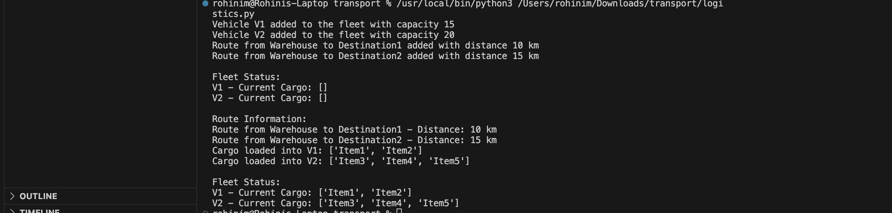

# Transport Management System

Implementation of a Transport Management System in Python, focusing on vehicles, routes, and cargo handling.

## Table of Contents

- [Introduction](#introduction)
- [Features](#features)
- [Prerequisites](#prerequisites)

## Introduction

This Python script provides a simple implementation of a Transport Management System. It includes classes for vehicles, routes, and basic cargo handling functionalities.

## Features

- **Vehicle Class:** Represents a transport vehicle with specified capacity and cargo loading capabilities.
- **Route Class:** Represents a route between source and destination with a given distance.
- **TransportManagementSystem Class:** Manages the fleet of vehicles and routes, providing basic functionalities.

## Improved the business and data modeling aspects:
Vehicle class has a fuel_efficiency attribute and a method calculate_fuel_consumption to model fuel efficiency.
The emission_standard attribute represents the emission standard compliance of the vehicle.
The calculate_emission method estimates emissions based on distance and emission standards.

## Cardinality

Vehicle and TransportManagementSystem: 1:many.
One TransportManagementSystem can manage multiple vehicles.
Route and TransportManagementSystem: 1:many.
One TransportManagementSystem can manage multiple routes 
Vehicle and Route:
There is no direct relationship between Vehicle and Route in the provided code.

